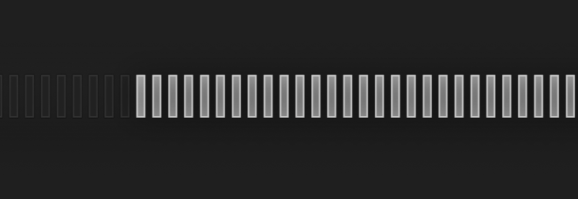

# Electron lingering shadow repro

This repository includes a repro for a problem with Electron (or possibly
Chromium itself) where when a transparent window is used with semi-transparent
elements on the page, shadows and ghosts might linger even after the elements
have been changed or removed.

It is a cool effect for simulating a crappy OLED, but in most cases undesirable.

The only fix I was able to come up with is a full window refresh.

Run using `bun install` to install Electron followed by `bunx electron .`.

## Status

Turns out this was a dupe of an old issue:

https://github.com/electron/electron/issues/8847

The "fix" is to add `hasShadow: false` when constructing the window.
This is a Chromium issue, not an Electron issue per se.

Other issues: https://github.com/electron/electron/issues/8557 and
https://github.com/electron/electron/issues/3836.

According to the oldest issue, this is probably an underlying Chromium issue at
its core.
